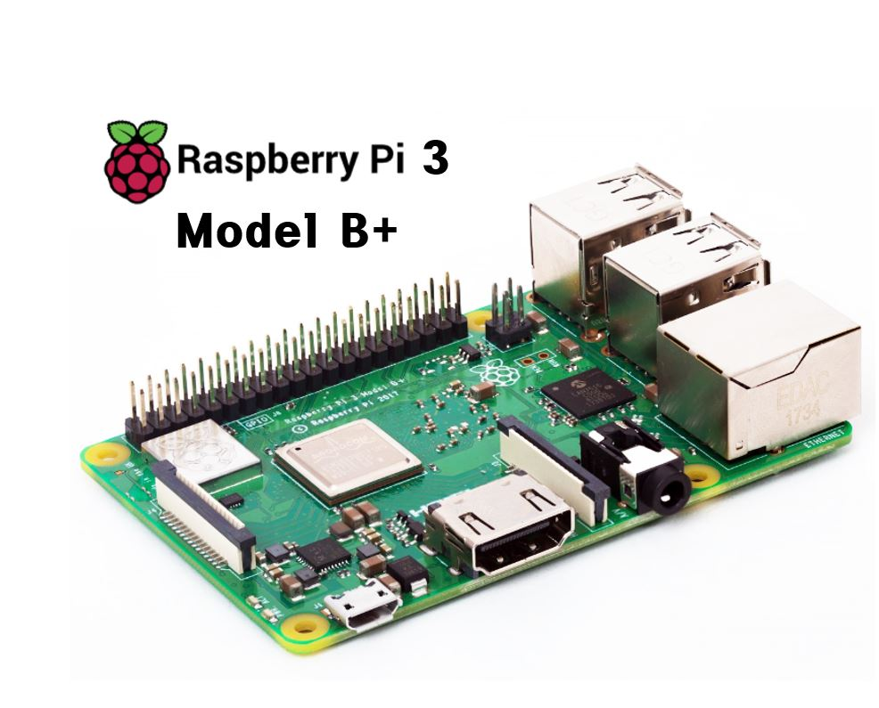
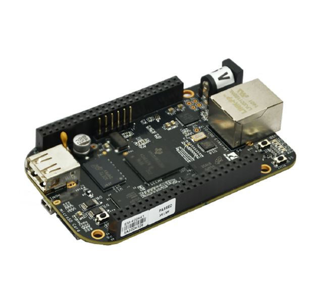

# 아두이노 소개하기

작성자 : 정래진(jrj8819)

작성일 : 2018. 11. 01

수정일 : 2018. 11. 02 

교제명 : 최재규, 이준혁, "아두이노, 상상을 현실로 만드는 프로젝트 입문편", 영진닷컴, 2018.

## 오픈소스 하드웨어란?

### 오픈소스 라이선스의 종류

#### Apache Licence

아파치 소프트 재단이 만든 라이선스이다. 아파치 라이센스가 있는 코드를 사용한 소프트웨어는 소스코드를 공개하지 않아도 되자만 아파치 라이센스의 코드를 수정하였다면, 아파치 라이선스를 표시해야 한다.

예) 안드로이드 ( https://source.android.com/license )

#### GPL(General Public Licence)

자유 소프트웨어 재단(Free Software Foundation)에서 만든 라이선스이다. GPL 라이선스의 프로그램은 어떤 목적, 형태로 사용할 수 있지만, 사용하거나 수정하는 경우 만든 소스코드를 공개해야 한다.

예) git ( https://git-scm.com/downloads  https://github.com/git/git )

#### MIT Licence

미국 매사추세츠 공과대학교(Massachusetts Institute of Technology)에서 만든 라이선스이다. 라이선스를 가진 소프트웨어를 사용하면 저작권 관련 명시를 해주어야 한다.

예) 부트스트랩 ( http://getbootstrap.com )

##### 정리

| 라이선스       | 필수사항                                                     | 허락조건                                                     | 금지조건                                  |
| -------------- | ------------------------------------------------------------ | ------------------------------------------------------------ | ----------------------------------------- |
| Apache Licence | - 라이선스 및 저작권 명시 - 변경사항 안내                 | - 상업적 이용 가능 - 배포가능 - 수정가능 - 특허신청가능 - 사적이용가능 - 2차 라이선스 | - 보증책임 없음 - **상표권 침해금지** |
| GPL            | - 수정한 소프트웨어 소스코드 혹은 GPL 소스코드를 활용한 소프트웨어 모두 GPL로 공개 - 라이선스 및 저작권 명시 - 변경사항 안내 | - 상업적 이용가능 - 배포가능 - 수정가능 - 특허신청가능 - 사적이용가능 | - 보증책임없음 - 2차 라이선스         |
| MIT            | - 라이선스 및 저작권 명시                                    | - 상업적이용가능 - 배포가능 - 수정가능 - 사적이용가능 - 2차 라이선스 | - 보증책임 없음                           |

 출처 : http://www.bloter.net/archives/209318

### 오픈소스 하드웨어의 종류

#### 라즈베리파이(Raspberry Pi)

영국 라즈베리파이 재단에서 학교와 개발도상국에서 기초 컴퓨터 과학의 교육을 증진시키기 위해 개발한 싱글보드 컴퓨터이다.

참고자료 : "200만원 이면 개인용 슈퍼 컴퓨터 만든다." ( http://www.zdnet.co.kr/news/news_view.asp?artice_id=20130527091137 ) 

출처 : 위키백과 ( [https://ko.wikipedia.org/wiki/라즈베리_파이](https://ko.wikipedia.org/wiki/라즈베리_파이) )

#### 비글본(Beagle Bone)

텍사스 인스트루먼트에서 디지와의 재휴로 생산하고 있는 저전력 오픈 소스 하드웨어 이다.

출처 : 위키백과 ( [https://ko.wikipedia.org/wiki/비글보드](https://ko.wikipedia.org/wiki/비글보드) )

## 아두이노의 탄생

### 피지컬 컴퓨팅 예시

코끼리 협동조합 홍보 영상

https://www.facebook.com/co77iri/videos/1237646449683360/

https://www.facebook.com/co77iri/videos/1237646449683360/

[https://www.youtube.com/watch?v=_8qf3nFwwOM](https://www.youtube.com/watch?v=_8qf3nFwwOM)

출처 : 코키리협동조합 페이스

## 다양한 아두이노

사물인터넷 플랫폼 Temboo 영상

https://youtu.be/nvo18-n50So

출처 : 유튜브 영상

# 사물 인터넷 사례

스위처 홍보영상 : https://youtu.be/cFZuqxopG4c