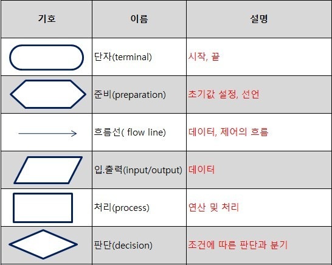
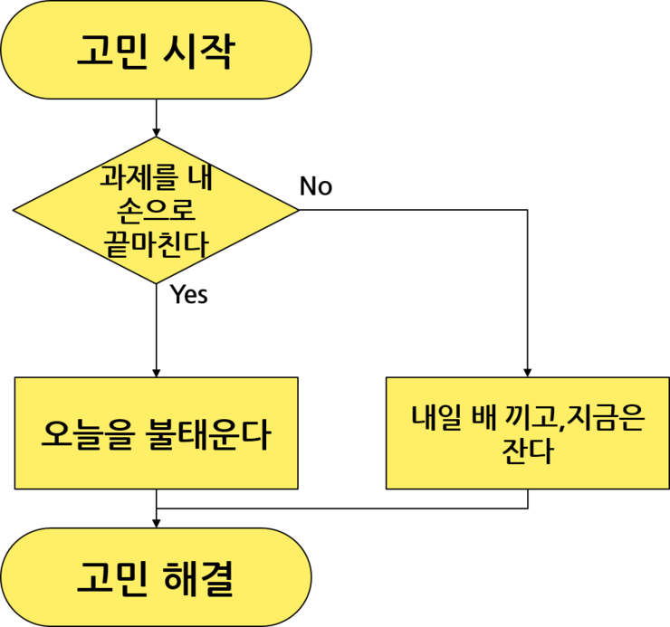

# 아두이노를 위한 프로그래밍 기초

## 정보를 담는 그릇 : 변수

### 변수의 종류

| 변수타입 | 저장 가능 값                                   |
| -------- | ---------------------------------------------- |
| int      | 정수형 데이터 (-32,768~32,767)                 |
| long     | 정수형 데이터 (-2,147,483,648~2,147,483,647)   |
| byte     | 부호 없는 숫자 (0~255)                         |
| float    | 실수형 데이터 (-3.4028235E+38 ~ 3.4028235E+38) |
| char     | 하나의 문자를 저장                             |
| string   | 문자열을 저장                                  |
| array[]  | 배열 값 저장                                   |
| const    | 상수(변하지 않는 고정된 값) 선언               |

## 순서도 (Flowchart)

프로그림의 실행순서를 그림으로 표시한 것

### 블록 소개

### 작성 예시

출처 : 

[http://minhs.tistory.com/entry/순서도-기호-정리](http://minhs.tistory.com/entry/%EC%88%9C%EC%84%9C%EB%8F%84-%EA%B8%B0%ED%98%B8-%EC%A0%95%EB%A6%AC)

https://m.blog.naver.com/PostView.nhn?blogId=seonjong0109&logNo=40210050621&proxyReferer=https%3A%2F%2Fwww.google.com%2F