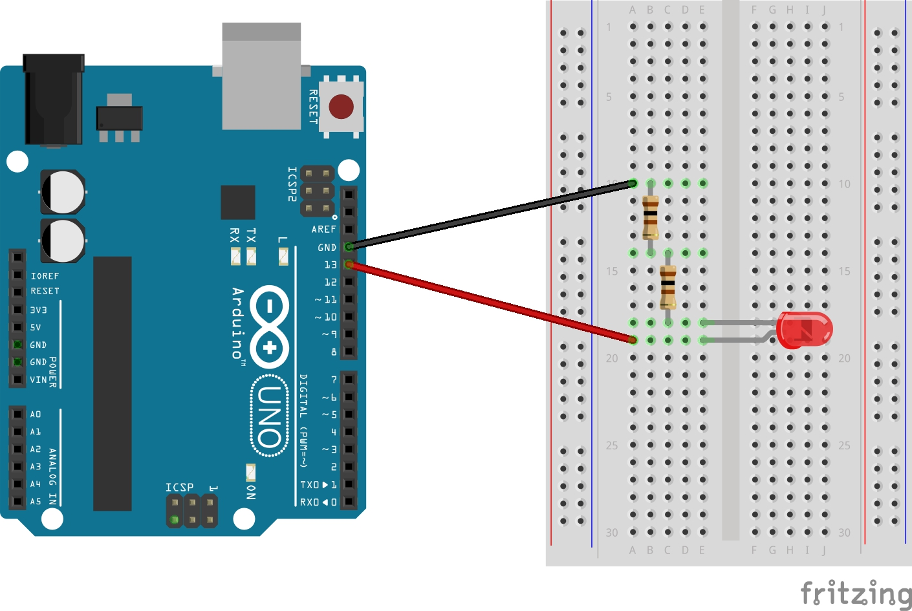
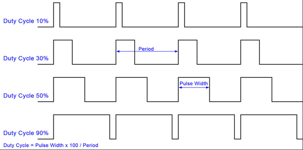
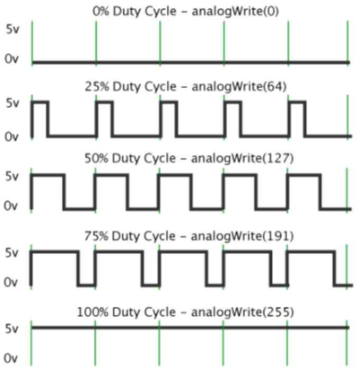

# 디지털과 아날로그

## 디지털 이해하기

### 회로도

## 아날로그 이해하기

### 아두이노에서 아날로그 신호

아두이노(우노)는 내부에서 0 또는 1로 구동되는 디지털 시스템이다. 아두이노(우노)는 기본적으로 디지털 신호를 아날로그 신호로 바꾸기 위한 (DAC : Digital Analog Converter) 가 내장 되어 있지 않으므로 PWM(펄스 폭 변조) 방식으로 디지털 신호를 아날로그 신호처럼 표시하여 나타낸다.

## PWM(Pulse Width Modulation, 펄스 폭 변조)

디지털 신호의 한 주기 (Period) 안에서 신호의 상태가 On인 상황(Pulse Width)과 Off 의 비율(Duty Cycle)을 조절하여 아날로그 신호처럼 제어할 수 있는 방법

###  아두이노의 analogWrite() 함수와 PWM

아두이노의 analogWrite()함수를 활용하여 신호의 Duty Cycle을 바꿀 수 있고 신호가 On인 상황 (Pulse Width)을 제어하여 연속적인 0~255 사이의 값을 표현할 수 있다

아두이노 우노의 경우 5, 6번 핀은 한 주기(Period)가 490Hz, 3, 9, 10, 11번 핀은 980Hz로 설정되어 있다. 주기가 빠를 수록 더 자주 주기가 반복되어 빠르게 신호가 출력된다.

출처 : http://openstory.tistory.com/65