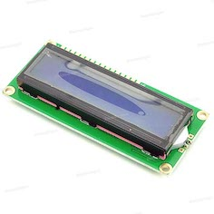
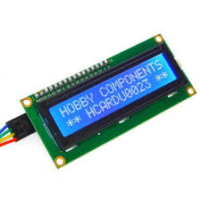
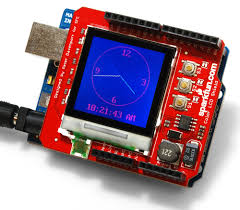
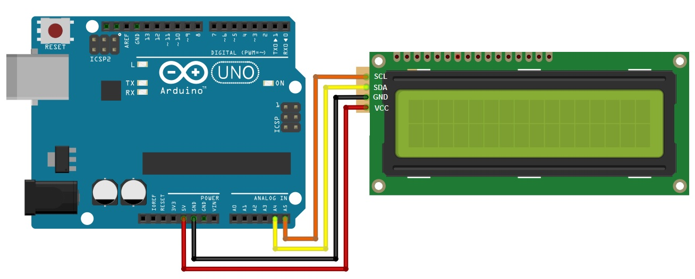
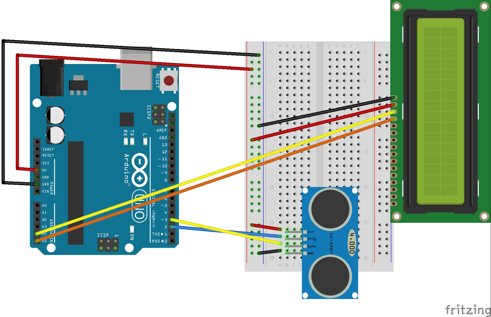

# 11장 LCD 사용하기 보조자료

아두이노와 각종 센서를 연결해 센서로부터 측정된 정보나 계산된 결과를 확인하는 방법은 시리얼 모니터를 이용한 방법이 일반적이다. 하지만 항상 컴퓨터와 아두이노를 연결할 수 없기 때문에 별도의 디스플레이 장치가 필요하다. LCD는 아두이노에 연결되어 글자, 숫자를 출력하는데 자주 사용되는 장치이며, LCD 장치에 따라 단색/ 컬럭/ 출력 글자수가 다르다.

**1602 LCD**



**1602 LCD + I2C**



**Color LCD Shield**




디스플레이 장치 중에서 비교적 저렴한 1602 LCD가 만이 사용되며 1602 LCDsms 16개 연결 커넥터가 있어 아두이노에 모두 연결해야 동작이 가능하다. 연결할 선이 많아 연결이 복잡해질 뿐만 아니라 센서나 추가 장치 연결에 어려움이 많다.

이러한 문제를 해결해주는 장치가 I2C 이다. I2C는 Inter-Integrated Circult의 약자로 필립스에서 개발한 임베디드 시스템, 휴대전화 등에서 주변 기기를 연결하기 위해 사용된다.


##  회로 연결



| 아두이노 | 1602 LCD  + I2C 모듈 |
| -------- | -------------------- |
| A4       | SDA                  |
| A5       | SCL                  |
| 5V       | 5V                   |
| GND      | GND                  |


## 라이브러리 추가

1602 LCD + I2C 모듈을 사용하기 위해서는 라이브러리를 추가해야 한다. 다음 웹 주소에서 라이브러리를 다운로드 받을 수 있다.

https://github.com/fdebrabander/Arduino-LiquidCrystal-I2C-library

다운로드 된 zip파일을 메뉴바에서 스케치 > 라이브러리 포함하기 > .zip라이브러리 추가를 선택하여 다운로드 한 파일을 등록한다.


## 예제 - Hello world 출력하기

```c
#include <Wire.h>                
#include <LiquidCrystal_I2C.h>  

// Set the LCD address to 0x27 for a 16 chars and 2 line display
LiquidCrystal_I2C lcd(0x3F, 16, 2); 

void setup()
{
	// initialize the LCD
	lcd.begin();

	// Turn on the blacklight and print a message.
	lcd.backlight();
	lcd.print("Hello, world!");
}

void loop()
{
	// Do nothing here...
}
```


## 함수 설명

| 함수                      | 설명                               |
| ------------------------- | ---------------------------------- |
| lcd.backlight();          | LCD 백라이트를 켠다                |
| lcd.noBacklight();        | LCD 백라이트를 끈다                |
| lcd.noDisplay();          | LCD 표시된 내용을 숨긴다           |
| lcd.display();            | LCD 표시 내용을 보여준다           |
| lcd.cursor();             | LCD 커서를 표시한다                |
| lcd.noCursor();           | LCD 커서를 없앤다                  |
| lcd,setCursor(x,y);       | LCD 해당 LCD 좌표(x, y)로 커서이동 |
| lcd.home();               | 커서를 (0, 0)좌표로 이동           |
| lcd.blink();              | 커서를 깜빡임                      |
| lcd.noBlink();            | 커서를 깜빡이지 않음               |
| lcd.write(36);            | 아스키코드 값으로 문자를 출력      |
| lcd.print("Hello World"); | LCD 화면에 값을 출력               |
| lcd.clear();              | LCD 모든 내용 지움                 |
| lcd.scrollDisplayRight(); | LCD 내용을 우측으로 1칸 스크롤     |
| lcd.scrollDisplayLeft();  | LCD 내용을 좌측으로 1칸 스크롤     |


## 참고 - I2C Address 확인하기

I2C 장치의 address를 찾기 위한 소스코드 시리얼 모니터로 I2C 장치의 Address를 확인할 수 있다.

```c
#include <Wire.h>

void setup() {
  // put your setup code here, to run once:
  Serial.begin(9600);
  while(!Serial) {}
  Serial.println("address scanning");
  byte count = 0;
  Wire.begin();
  for(byte i =1; i < 120; i++) {
    Wire.beginTransmission(i);
    if(Wire.endTransmission() == 0) {
      Serial.print("Found address : ");
      Serial.print(i, DEC);
      Serial.print("( 0X");
      Serial.print(i, HEX);
      Serial.println(")");
      count++;
      delay(10);
    }
  }
  Serial.println("Done.");
  Serial.print("Found it ");
  Serial.print(count, DEC);
  Serial.println(" device(s).");
}

void loop() {
  // put your main code here, to run repeatedly:

}
```


