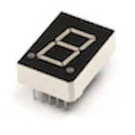
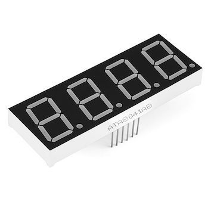
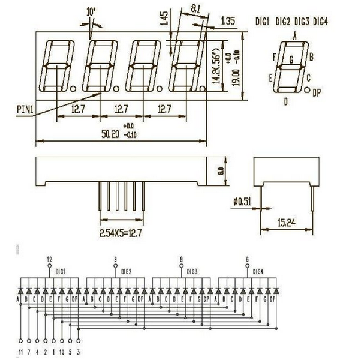
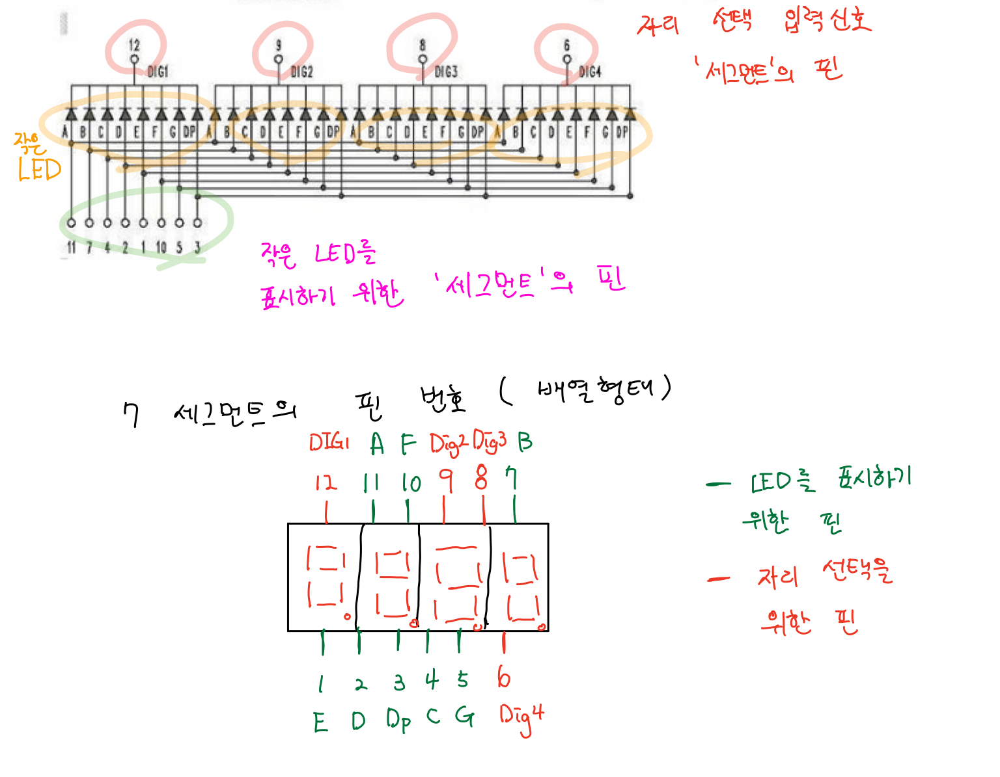
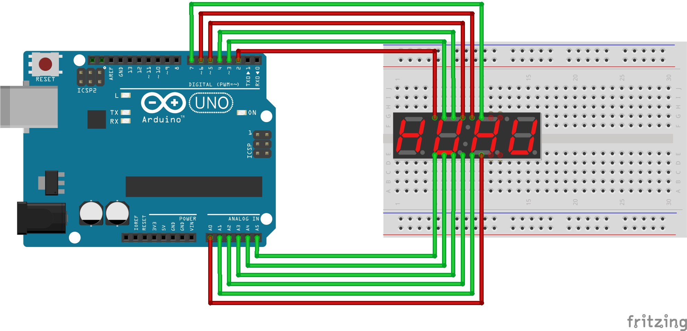

# 배열형태의 7세그먼트를 활용

싱글형태의 7세그먼트를 여러개 활용하게 되면 필요한 핀의 수가 많아져 사용하기 불편한 점이 있다. 대신 배열형태의 7 세그먼트를 활용하면, 상대적으로 적은 수의 핀으로 여러개의 세그먼트를 표시할 수 있는 장점이 있어 많이 활용된다.

## 타입과 회로도를 확인하자.

7세그먼트는 동작 방식에 따라 아노드, 캐소드 타입으로 구분된다. 배열 형태의 7세그먼트도 마찬가지인데, 아노드 타입은 특정 자릿수의 7 세그면트의 LED를 켜고 싶다면 해당 자리의 신호(DIG1, DIG2, DIG3, DIG4 ... )를 켤때는 LOW로 끌때는 HIGH로 설정해야 한다. 반대로 캐소드 타입은 자리의 신호를 HIGH로 끌때는 LOW로 선택해야 한다.

배열형태의 7세그먼트의 회로도에서 자리의 신호는 8개의 작은 LED로 연결되어 있다. 

### 회로도에 대한 해설

## 아두이노와의 연결

