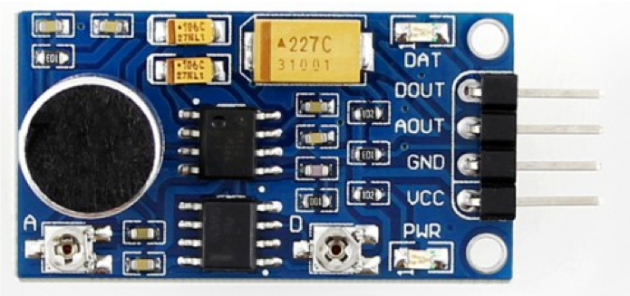
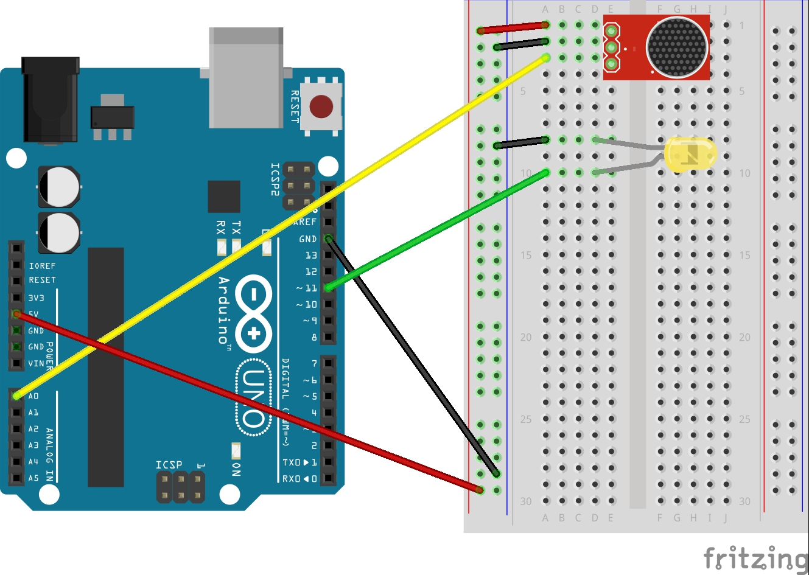

# 사운드 감지 센서

사운드 감지 센서는 소리의 크기를 측정하는 센서이다. 소리의 크기를 아날로그 값(0~1023)으로 출력해주며, 감지된 소리가 클수록 더 큰 값을 출력하게 된다.

 


## 회로 연결



| 아두이노 | 사운드 센서 |
| -------- | ----------- |
| A0       | A0          |
| 5V       | VCC         |
| GND      | GND         |

| 아두이노 | LED  |
| -------- | ---- |
| 11       | + 극 |
| GND      | - 극 |


## 예제 코드


```c
int sound_pin = A0;
int led_pin = 11;

void setup() {
  Serial.begin(9600);
  pinMode(led_pin, OUTPUT);
}

void loop() {
  int sound_value = analogRead(sound_pin);
  int light_value = map(sound_value, 0, 1023, 0, 255);

  Serial.print("sound value : ");
  Serial.println(sound_value);

  Serial.print("light value : ");
  Serial.println(light_value);

  analogWrite(led_pin, light_value);
  delay(100);
}
```

