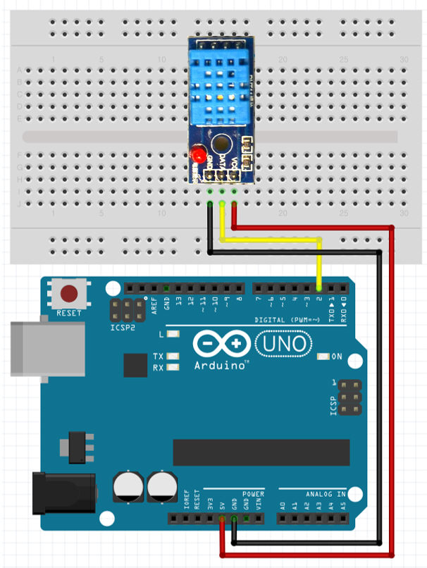

# 온도 감지 센서 활용하기

온도센서는 온도를 측정하는 센서로 많이 보편화된 만큼 여러 종류의 센서, 모듈이 존재한다. 실습해 볼 DHT11 센서는 온도 뿐만 아니라 습도도 측정할 수 있다.

**LM35**


**DHT11**


## 회로 구성

| 아두이노 | 온도센서 |
| -------- | -------- |
| 2        | DATA     |
| GND      | GND      |
| 5V       | VCC      |




## 라이브러리 다운로드

아래 링크의 라이브러리를 다운받아 아두이노 IDE에 적용해야 센서의 값을 편리하게 읽어올 수 있다. 아래 링크를 눌러 라이브러리를 다운받자.

**라이브러리 다운로드** :  [https://github.com/adidax/dht11/archive/master.zip](https://github.com/adidax/dht11/archive/master.zip)


라이브러리를 설치하는 방법은 다운로드 된 zip파일을 메뉴바에서 스케치 > 라이브러리 포함하기 > .zip라이브러리 추가를 선택하여 다운로드 한 파일을 등록한다.


## 소스코드

```c
#include <dht11.h>
 
int DHT11PIN = A0;            //Signal 이 연결된 아두이노의 핀번호
 
dht11 DHT11;
  
void setup()
{
  Serial.begin(9600);  //시리얼 통신속도 설정
}
  
void loop()
{
  int chk = DHT11.read(DHT11PIN);
  
  Serial.print("Temp: ");
  Serial.print((float)DHT11.temperature);
  Serial.print(" C ");
   
  Serial.print("/ RelF: ");
  Serial.print((float)DHT11.humidity);
  Serial.print(" %");
 
  Serial.println();
   
  delay(2000);
}


```

