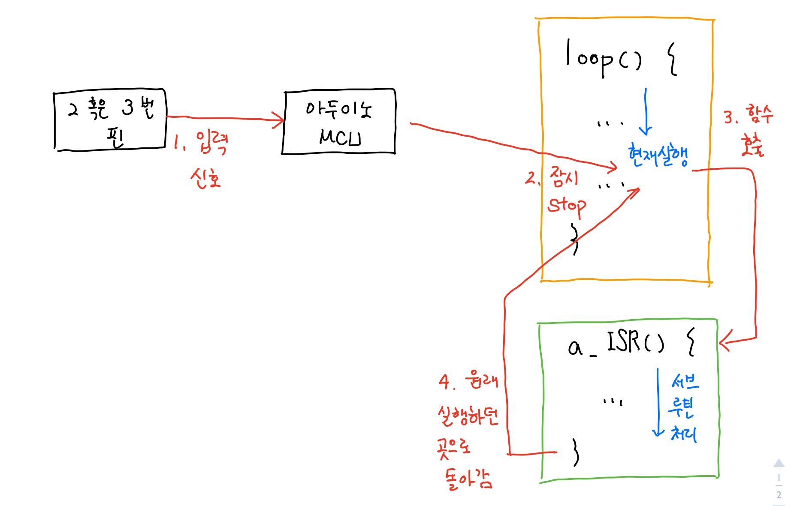
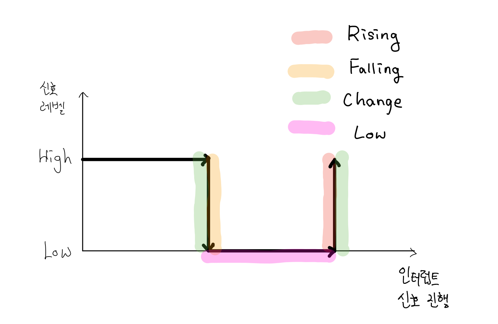

# 인터럽트 이해하기

인터럽트(Interrupt)는 코드가 실행중에서 특정 조건이 만족되었을 경우, 현재 실행하는 코드를 잠시 중지하고 조건에 등록된 함수를 수행하는 기능이다.

아두이노에서 인터럽트는 loop()함수의 코드를 실행하다가, 특정 핀(우노인 경우 2, 3번 핀)에 신호가 발생하면 하던일을 중단하게 된다. 이후 각 핀에 등록된 함수(인터럽트 서브 루틴 : Interrupt sub routine)를 실행하고 나서는 원래 수행되던 위치(loop()함수)로 돌아간다.



인터럽트를 이용하기 위해서는 attachInterrupt()함수를 활용해야 한다. attachInterrupt() 함수는 다음과 같이 3개의 매개 변수를 갖는다.

```c
attachInterrupt(interrupt, ISR, mode)
```

첫번째 매개 변수 : **인터럽트의 번호**를 의미하며, 아두이노 우노의 경우 0 또는 1이 된다.

두번째 매개 변수 : 인터럽트 발생시 호출될 **인터럽트 서브 루틴(함수)의 이름**

세번째 매개 변수 : **인터럽트의 발생 조건**, RISING, FALLING, CHANGE, LOW 4가지 값이 있다.


##### 인터럽트의 발생 조건

- RISING : 인터럽트 신호가 LOW에서 HIGH로 신호가 변하는 순간.
- FALLING : 인터럽트 신호가 HIGH에서 LOW로 신호가 변하는 순간.
- CHANGE : 인터럽트 신호가 LOW에서 HIGH로 신호가 변하는 순간 혹은 HIGH에서 LOW로 신호가 변하는 순간.
- LOW : 인터럽트 신호가 LOW에 있는 동안 계속 발생




## 인터럽트의 활용 예시

```c
int btn1_pin = 2;
int btn2_pin = 3;

volatile int count1 = 0;
volatile int count2 = 1;

void setup() {
  Serial.begin(9600);
  pinMode(btn1_pin, INPUT);
  pinMode(btn2_pin, INPUT);

  attachInterrupt(0, btn1ISR, RISING);
  attachInterrupt(1, btn2ISR, CHANGE);
}

void loop() {
  delay(1000);
}

void btn1ISR() {
  count1 += 1;
  Serial.print("count1 : ");
  Serial.println(count1);
}

void btn2ISR() {
  count2 += 1;
  Serial.print("count2 : ");
  Serial.println(count2);
}


```

