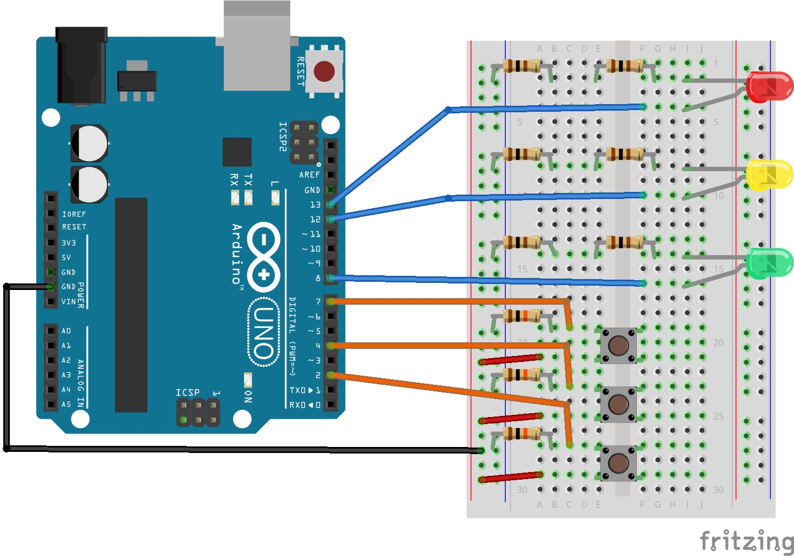

# Quiz) 다음 회로를 구성하고 LED 3개(red, yellow, green)가 각 버튼을 눌렸을 때 다음과 같은 시나리오로 점등되는 아두이노 코드를 작성하자.

#### 시나리오

**왼쪽 LED 버튼** : 모든 LED가 꺼진 후 6초동안 노랑색 LED가 깜빡이고 빨강색  LED가 계속 점등된다.

**가운데 LED 버튼** : 모든 LED가 꺼진 후 6초 동안 노랑색 LED가 깜빡이고 초록색 LED가 계속 점등된다.

**오른쪽 LED 버튼** : 모든 LED가 꺼진다.

